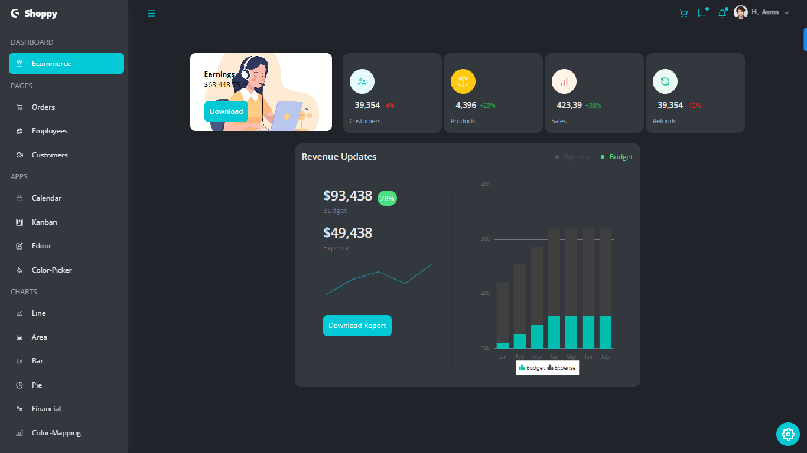

# Simple Admin Dashboard

This is mi personal portfolio by using some 3D animations.




## Getting Started


### Prerequisites


* HTML/CSS
* JavaScript
* React.js
* Tailwind Css
* Syncfusion

### Installation

A step by step guide that will tell you how to get the development environment up and running.

```
$ npm install (Install node dependecies)
$ npm start (Run server)
```


## Deployment

[click here to check live version](https://resplendent-pithivier-22046c.netlify.app/)

## Additional Documentation and Acknowledgments

* JavaScript Master
* Syncfusion
* etc...